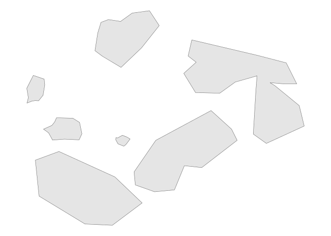
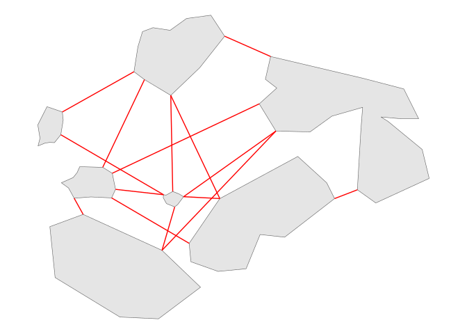
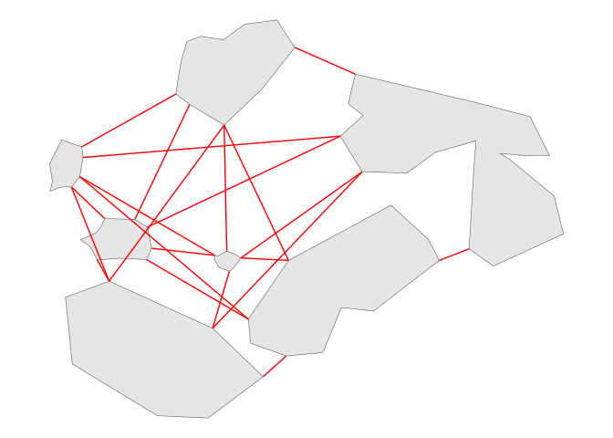
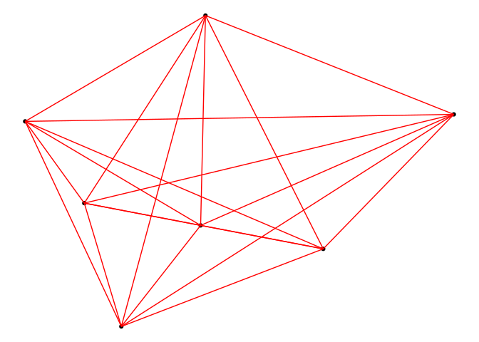
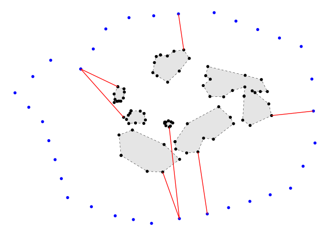

# Calcular distancias mínimas


## Tutorial

Este tutorial muestra como utilizar las tres funciones para calcular
distancias mínimas entre objetos: `min_connectionsPolygons`,
`min_connectionsPoints`, y `min_distPoints2Obj`.

Los archivos que utiliza el tutorial se descargan de la carpeta `data`.
Los archivos son: `poligonos_Distancias.shp` y
`poligonos_Perimetro.shp`.

Los paquetes que utilizan son `tidyverse` y `sf`.

El conjunto de polígonos con el que ejemplificaré se muestra en la
<a href="#fig-1" class="quarto-xref">Figure 1</a>:

``` r
library(tidyverse)
library(sf)

poligono_ejemplo <- st_read("data/poligonos_Distancias.shp") 
```

    Reading layer `poligonos_Distancias' from data source 
      `/home/pacheco/Documents/R/distanciasMinimas/data/poligonos_Distancias.shp' 
      using driver `ESRI Shapefile'
    Simple feature collection with 7 features and 1 field
    Geometry type: POLYGON
    Dimension:     XY
    Bounding box:  xmin: -102.241 ymin: 19.51385 xmax: -101.832 ymax: 19.81226
    Geodetic CRS:  WGS 84

``` r
ggplot(poligono_ejemplo) +
  geom_sf()+
  theme_void()
```

<div id="fig-1">



Figure 1: Polígonos ejemplo.

</div>

### min_connectionsPoints

La función `min_connectionsPolygons` calcula la distancias que hay entre
un conjunto de **polígonos**. Utiliza como base una sola capa
multipolígono que contenga todos los polígonos de los cuáles se quiera
conocer la distancia mínima que hay entre ellos.

La función puede determinar si no se quieren conexiones mínimas
sobrelapadas con otros polígonos, para simular distancias “stepping
stones”. Para eliminarlas, se debe de declarar el argument en la función
`overlap_connection = T`. La
<a href="#fig-2" class="quarto-xref">Figure 2</a> muestra su aplicación.
La <a href="#fig-3" class="quarto-xref">Figure 3</a> muestra
`overlap_connection = F`.

``` r
#Carga la función
source("Functions/min_connectionsPolygons.R")

poligono_ejemplo_lineas_overLT = min_connectionsPolygons(polygon_shape =  poligono_ejemplo, overlap_connection = T)

ggplot(poligono_ejemplo) +
  geom_sf()+
  geom_sf(data = poligono_ejemplo_lineas_overLT, color = "red")+
  theme_void()
```

<div id="fig-2">



Figure 2: Distancias entre polígonos por medio de la función
min_connectionsPolygons y su argumento overlap_connection = T.

</div>

``` r
poligono_ejemplo_lineas_overLF = min_connectionsPolygons(polygon_shape =  poligono_ejemplo, overlap_connection = F)

ggplot(poligono_ejemplo) +
  geom_sf()+
  geom_sf(data = poligono_ejemplo_lineas_overLF, color = "red")+
  theme_void()
```

<div id="fig-3">



Figure 3: Distancias entre polígonos por medio de la función
min_connectionsPolygons y su argumento overlap_connection = F

</div>

### min_connectionsPoints

La función `min_connectionsPoints` calcula la distancias que hay entre
un conjunto de **puntos**. Utiliza como base una sola capa que contenga
todos los puntos de los cuáles se quiera conocer la distancia mínima que
hay entre todos ellos. En el ejemplo de la
<a href="#fig-4" class="quarto-xref">Figure 4</a> se obtienen los
centroides de de los polígonos utilizados anteriormente.

``` r
puntos_ejemplo_centroid <- st_centroid(poligono_ejemplo)
```

    Warning: st_centroid assumes attributes are constant over geometries

``` r
ggplot(puntos_ejemplo_centroid) +
  geom_sf()+
  theme_void()
```

<div id="fig-4">


Figure 4: Centroides de polígonos

</div>

``` r
#Carga la función
source("Functions/min_connectionsPoints.R")

puntos_ejemplo_lineas <- min_connectionsPoints(puntos_ejemplo_centroid)

ggplot(puntos_ejemplo_centroid) +
  geom_sf()+
  geom_sf(data = puntos_ejemplo_lineas, color = "red")+
  theme_void()
```



## min_distPoints2Obj

La función `min_distPoints2Obj` calcula la distancia que hay de puntos
focales a otros de interes (ej. a un centro, a una periferia o a otros
puntos que constituyan polígonos). La función proporciona capas de
`líneas` y sus distancias. En este ejemplo calculamos las distancias de
nuestros polígonos a un perímetro, representado por
`poligonos_Perimetro` y que mostramos en
<a href="#fig-5" class="quarto-xref">Figure 5</a>.

``` r
perimetro <- st_read("data/poligonos_Perimetro.shp")
```

    Reading layer `poligonos_Perimetro' from data source 
      `/home/pacheco/Documents/R/distanciasMinimas/data/poligonos_Perimetro.shp' 
      using driver `ESRI Shapefile'
    Simple feature collection with 1 feature and 1 field
    Geometry type: POLYGON
    Dimension:     XY
    Bounding box:  xmin: -102.4985 ymin: 19.38849 xmax: -101.7193 ymax: 19.90325
    Geodetic CRS:  WGS 84

``` r
ggplot() +
  geom_sf(data = perimetro, fill = "transparent", color = "black")+
  geom_sf(data = poligono_ejemplo)+
  theme_void()
```

<div id="fig-5">


Figure 5: Polígono de perimetral y los polígonos interiores para
calcular distancia mínima de polígonos hacia el perímetro más cercano.

</div>

El perímetro lo segmentizamos a puntos con distancias equidistantes y lo
transformamos a puntos. Posteriormente aplicamos la fución entre los
puntos que constituyen nuestros polígonos y los puntos equidistantes.
Sus distancias de muestras en la
<a href="#fig-6" class="quarto-xref">Figure 6</a>:

``` r
#SEGMENTIZA A UN POLIGONO CON CREADO POR VECTORES SEPARDOS EQUIDISTANTES A UNA DISTANCIA dfMaxLength = X.
buffer_densified_poly <- st_segmentize(perimetro, dfMaxLength = 10000)

#TRANSFORMA EL SEGMENTO EN PUNTOS SEPARADOS EQUIDISTANTES
buffer_densified_poly <-   st_cast(buffer_densified_poly, "LINESTRING") |>  st_cast("POINT") 

#TRANSFORMA NUESTROS POLIGONOS A UN FORMATO DE PUNTOS
puntos_pol = st_cast(poligono_ejemplo, 'POINT')
```

``` r
#CARGA LA FUNCIÓN
source("Functions/min_distPoints2Obj.R")

lineas_minimas_FocalesObjetivo = min_distPoints2Obj(puntos_pol, id = "id", puntosObj = buffer_densified_poly)

ggplot() +
  geom_sf(data = buffer_densified_poly, color = "blue")+
  geom_sf(data = poligono_ejemplo, color = "black", linetype = 2)+
  geom_sf(data = puntos_pol, color = "black")+
  geom_sf(data = lineas_minimas_FocalesObjetivo, color = "red")+
  theme_void()
```

<div id="fig-6">



Figure 6: Distancias mínimas entre polígonos y el perímetro que las
rodea.

</div>
